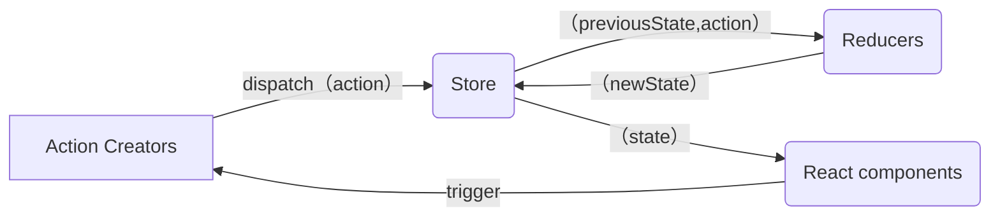

# mini-redux

## Reducer

接收舊的狀態和 action，返回新的狀態。
像是 `Array.reduce(reducer, initialValue);`

```js
(previousState, action) => newState;
```

是 純函數(Pure Function)，傳入相同的參數會有相同的回傳值！
所以不能夠：

1. 修改傳入的參數
2. 使副作用發生，比方 API 或是 路由跳轉
3. 調用非純的函式，比方 `Date.now()`, `Math.random()`，每次調用產生的結果都不同


