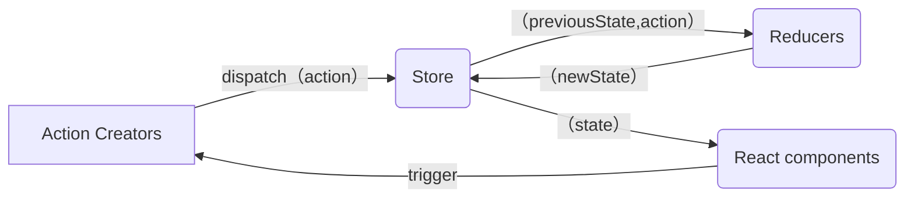

- [mini-redux](#mini-redux)
  - [Reducer](#reducer)
    - [基礎架構](#基礎架構)
  - [applymiddleware 中間件](#applymiddleware-中間件)
  - [combineReducers](#combinereducers)
  - [react-redux](#react-redux)
    - [實現 bindActionCreators](#實現-bindactioncreators)
    - [實現 Provider, connect](#實現-provider-connect)
    - [hooks - useSelector, useDispatch](#hooks---useselector-usedispatch)
    - [結合 react 18: useSyncExternalStore](#結合-react-18-usesyncexternalstore)
  - [redux-toolkit](#redux-toolkit)
    - [基本使用](#基本使用)
    - [實作 rtk](#實作-rtk)
      - [configureStore](#configurestore)
      - [createSlice](#createslice)
    - [非同步解決方案](#非同步解決方案)
      - [redux-thunk](#redux-thunk)
      - [redux-saga](#redux-saga)
        - [啟動](#啟動)
        - [實作](#實作)
          - [effects](#effects)
          - [createSagaMiddleware](#createsagamiddleware)
          - [runSaga](#runsaga)

# mini-redux

## Reducer

接收舊的狀態和 action，返回新的狀態。
像是 `Array.reduce(reducer, initialValue);`

```js
(previousState, action) => newState;
```

是 純函數(Pure Function)，傳入相同的參數會有相同的回傳值！
所以不能夠：

1. 修改傳入的參數
2. 使副作用發生，比方 API 或是 路由跳轉
3. 調用非純的函式，比方 `Date.now()`, `Math.random()`，每次調用產生的結果都不同



- 核心要實現

  - 存儲狀態
  - 獲取狀態
  - 更新狀態
  - 變更訂閱

### 基礎架構

> src/store/index.js

```ts
// import { createStore } from "redux";
import { createStore } from "../mini-redux/index.ts";

function countReducer(state = 0, action) {
  switch (action?.type) {
    case "ADD":
      return state + 1;
    case "MINUS":
      return state - 1;
    default:
      return state;
  }
}

const store = createStore(countReducer);
export default store;
```

> src/pages/Test.tsx

```tsx
import React, { useLayoutEffect, useReducer } from "react";
import store from "../store";

const Test = () => {
  const [, forceUpdate] = useReducer((x) => x + 1, 0);

  useLayoutEffect(() => {
    return store.subscribe(() => {
      forceUpdate();
    });
  }, []);

  return (
    <div>
      state: {store.getState()}
      <button
        onClick={() => {
          store.dispatch({ type: "ADD" });
        }}
      >
        change
      </button>
    </div>
  );
};

export default Test;
```

> src/mini-redux/index.ts

```ts
import createStore from "./createStore.ts";
export { createStore };
```

> src/mini-redux/createStore.ts

```tsx
export default function createStore(reducer) {
  let currentState;
  let listeners: any[] = [];

  function getState() {
    return currentState;
  }

  function dispatch(action) {
    const newState = reducer(currentState, action);
    currentState = newState;
    listeners.forEach((l) => {
      l();
    });
  }

  function subscribe(listener: any) {
    listeners.push(listener);
    return () => {
      const index = listeners.indexOf(listener);
      listeners.splice(index, 1);
    };
  }

  // 初始數據
  dispatch({ type: "1111" });

  return {
    getState,
    dispatch,
    subscribe,
  };
}
```

## applymiddleware 中間件

如果想要處理副作用，要怎麼辦？想和服務端交互、異步處理，有辦法這樣寫嗎？

```ts
// 不是這樣
setTimeout(() => {
  store.dispatch({ type: "MINUS" });
}, 100);
// 想要改寫成這樣，異步處理 dispatch，有辦法嗎
store.dispatch((dispatch) => {
  setTimeout(() => {
    dispatch({ type: "MINUS" });
  }, 100);
});
```

redux 只是一個純粹的狀態管理工具，只支持同步。如果要支援異步，必須要使用中間件，比如 redux-thunk 和 redux-logger。對 `store.dispatch` 進行改造，在發出 action 和執行 reducer 這兩部之間，添加其他功能。

> src/store/index.js

```js
import { createStore, applyMiddleware } from "redux";
import { thunk } from "redux-thunk";
import logger from "redux-logger";

const store = createStore(countReducer, applyMiddleware(thunk, logger));
```

> src/pages/Test.tsx

```js
<button
  onClick={() => {
    store.dispatch((dispatch) => {
      setTimeout(() => {
        dispatch({ type: "ADD" });
      }, 1000);
    });
  }}
>
  async add
</button>
```

中間會需要利用 `compose` 和 `currying` 的概念。

- compose

  將三個函式結合成一個，並且把第一個函式返回值傳遞給下一個當作參數

  ```js
  function f1(arg) {
    console.log("f1", arg);
    return arg;
  }

  function f2(arg) {
    console.log("f2", arg);
    return arg;
  }

  function f3(arg) {
    console.log("f3", arg);
    return arg;
  }

  const fn = compose(f1, f2, f3);
  fn(123);
  ```

  利用 arguments 來處理

  ```js
  function compose(...funArgs) {
    if (funArgs.length === 0) {
      return (args) => args;
    }

    return function (...args) {
      return funArgs.reduce((acc, cur) => {
        return cur(acc);
      }, ...args);
    };
  }
  // args => f3(f2(f1(args)))
  // 可以在簡寫成這樣（但是執行的順序不同
  function compose(...funArgs) {
    if (funArgs.length === 0) {
      return (args) => args;
    }

    // 如果沒有傳初始值，則原陣列的第一個元素將會被當作初始的累加器。
    // [f1, f2, f3]。 f1 作為初始值
    // 再下一次，cur 函式會帶著 args 變成上個累加器的 arg
    // (f3(args)) => f1(f2(f3(args)))
    return funArgs.reduce((acc, cur) => {
      return (...args) => acc(cur(...args));
    });
  }
  ```

  為什麼會需要用到 `compose`?
  說到要改造 dispatch ，讓他可以層層被包住，交給下一棒處理

比方

```ts
const store = createStore(countReducer, applyMiddleware(logger2, logger));
```

發起 dispatch 時，會執行

```rust
logger2
    |
logger
    |
dispatch(action) 本身
    |
logger
    |
logger2
```

所以 middleware 要做的是，執行並且接收下一個函式 - logger 作為參數把 action ，把執行完的結果回傳。

```ts
const logger = (store) => (next) => (action) => {
  debugger;
  console.log("logger1 dispatch", action);
  const result = next(action);
  console.log("logger1 next state", store.getState());
  return result;
};

export default logger;
```

傳遞給 middleware 的 store 內的 dispatch ，不可以是最本來的，畢竟 middleware 是中間插件，最終執行的還是 `store.dispatch`。
所以針對每個 middleware 的 dispatch 必須要改寫：

```ts
const midAPI = {
  getState: store.getState,
  dispatch: (action, ...args) => store.dispatch(action, ...args),
};
```

在 `createStore` 中，接收第二個參數，也就是擴充，讓 `enhancer` 去改寫內部的 `store.dispatch`

```ts
export default function createStore(reducer, enhancer) {
  if (enhancer) {
    return enhancer(createStore)(reducer);
  }
  let currentState;
  let listeners: any[] = [];

  function getState() {
    return currentState;
  }

  function dispatch(action) {
    const newState = reducer(currentState, action);
    currentState = newState;
    listeners.forEach((l) => {
      l();
    });
  }

  function subscribe(listener: any) {
    listeners.push(listener);
    return () => {
      const index = listeners.indexOf(listener);
      listeners.splice(index, 1);
    };
  }

  // 初始數據
  dispatch({ type: "1111" });

  return {
    getState,
    dispatch,
    subscribe,
  };
}

const store = createStore(countReducer, applyMiddleware(logger2, logger));
```

```ts
export default function applyMiddleware(...middlewares) {
  return (createStore) => (reducer) => {
    const store = createStore(reducer);
    // const dispatch = store.dispatch;
    let dispatch = () => {
      throw new Error(
        "Dispatching while constructing your middleware is not allowed. " +
          "Other middleware would not be applied to this dispatch."
      );
    };
    const midAPI = {
      getState: store.getState,
      // 改寫了 dispatch 本身！
      dispatch: (action, ...args) => dispatch(action, ...args),
    };
    const chain = middlewares.map((middleware) => middleware(midAPI));
    // 執行完成後，每個中間件剩下這樣
    // (next) => (action) => {...}

    // 再把 store.dispatch 作為參數傳入
    dispatch = compose(...chain)(store.dispatch);

    return {
      ...store,
      dispatch,
    };
  };
}

function compose(...funArgs) {
  if (funArgs.length === 0) {
    return (args) => args;
  }
  if (funArgs.length === 1) {
    return funArgs[0];
  }

  return funArgs.reduce((acc, cur) => {
    return (...args) => acc(cur(...args));
  });
}
```

🌟🌟🌟 有意思的是這段

```js
const chain = middlewares.map((middleware) => middleware(midAPI));

dispatch = compose(...chain)(store.dispatch);
```

假設 `chain = [logger2, logger]`，那麼展開的結果是：

```js
dispatch = (...args) => logger2(logger(store.dispatch))(...args);
```

執行的順序是什麼呢？
分成兩段來看 `logger2(logger(store.dispatch))`、`(...args)`。
`logger(store.dispatch)` 執行完後，回傳的會是

```ts
// 從這樣
(next) => (action) => {
  console.log("logger1 dispatch", action);
  const result = next(action);
  console.log("logger1 next state", store.getState());
  return result;
};
// 變成這樣，作為 logger2 參數 next 傳入
(action) => {
  console.log("logger1 dispatch", action);
  const result = next(action);
  console.log("logger1 next state", store.getState());
  return result;
};
```

所以是 `logger2(logger1回傳函式)` 再次執行，回傳了差不多的函式，再接收 `logger2回傳函式(...args)` 作為後面執行的函式，所以是 logger2 優先執行！而不是上述 `compose` 那邊的範例的執行順序
`compose(f1, f2, f3)`，執行順序是 f3 → f2 → f1。
`compose(logger2, logger)`，執行順序是 logger2 → logger。
透過 currying 把 next 保留了。

面對異步的 dispatch，如果不處理的話，進入到 reducer 會跑到 default，

```ts
store.dispatch((dispatch) => {
  console.log("??!?!?1");
  setTimeout(() => {
    dispatch({ type: "ADD" });
  }, 1000);
});
```

模擬處理，簡單寫

```ts
const thunk =
  ({ getState, dispatch }) =>
  (next) =>
  (action) => {
    if (typeof action === "function") {
      return action(dispatch, getState);
    }
    return next(action);
  };
```

同樣如果是處理 promise，簡單寫

```ts
const thunk =
  ({ getState, dispatch }) =>
  (next) =>
  (action) => {
    return isPromise(action) ? action.then(dispatch) : next(action);
  };
```

## combineReducers

多個 reducer 時，可以分開寫再一起做處理

```ts
const store = createStore(
  combineReducers({
    count: countReducer,
    user: userReducer,
  }),
  applyMiddleware(logger2, logger, thunk)
);
```

使用時

```ts
store.getState().count;
```

```ts
export default function combineReducers(reducers) {
  return function (prevState = {}, action) {
    const nextState = {};
    let hasChanged = false;

    for (const key in reducers) {
      const reducer = reducers[key];
      nextState[key] = reducer(prevState[key], action);
      hasChanged = hasChanged || nextState[key] !== prevState[key];
    }

    // 簡單紀錄有沒有改變，返回前值或新值
    hasChanged =
      hasChanged ||
      Object.keys(nextState).length !== Object.keys(prevState).length;

    return hasChanged ? nextState : prevState;
  };
}
```

## react-redux

redux 跟 react 沒有關聯，可以獨立存在管理狀態，用 JS 寫成。因此有 react-redux 作為中間橋樑。
不用再讓用戶手動執行組件訂閱更新。

用法：直接在頂層加上 `Provider`，背後的思想是 context 跨層級傳遞數據。

```tsx
import { Provider } from "react-redux";
import store from "./store";

const root = ReactDOM.createRoot(
  document.getElementById("root") as HTMLElement
);
root.render(
  <React.StrictMode>
    <Provider store={store}>
      <App />
    </Provider>
  </React.StrictMode>
);
```

類組件要用 HOC 的方式， 接收組件作為參數返回新的組件，使用 `connect` 包裹，連接組件與 redux，
`connect` 接收兩個參數 `mapStateToProps` `mapDispatchToProps`：

```ts
mapStateToProps(state, [ownProps]):stateProps
```

需要注意性能： `ownProps` 是當前組件自己的 props，如果有且發生變化，`mapStateToProps` 就會被調用、重新計算！

```ts
mapDispatchToProps(dispatch: Object || Function, [ownProps]): dispatchProps
```

可省略不傳，默認情況下 `dispatch` 會注入到組件 props 內。
可以傳物件或是函式！
如果是物件的話，會被當成是 action creator，props 內會直接沒有 dispatch 函式可以調用。

```ts
{
    // react-redux 會在背後幫忙加上，變成 dispatch({type: "ADD"})
    add: (dispatch) => ({type: "ADD"}),
}
```

```ts
(dispatch) => {
  const creators = {
    // 如果是回傳函式，就要自行加上 dispatch
    add: (dispatch) => dispatch({ type: "ADD" }),
  };
  // 不加的話就要調用 bindActionCreators(creators, dispatch);
  const creators1 = bindActionCreators({
    minus: () => ({ type: "MINUS" }),
  });

  return {
    dispatch,
    ...creators,
  };
};
```

實際使用

```tsx
import { Component } from "react";
import { connect } from "react-redux";

/**
 * mapStateToProps 是參數，會把 state 加進去 props
 * mapStateToProps
 */
export default connect(
  // mapStateToProps,
  ({ count }) => ({ count }),
  mapDispatchToProps
)(
  class ReactReduxPage extends Component {
    render() {
      return (
        <div>
          ReactReduxPage
          {count}
        </div>
      );
    }
  }
);
```

### 實現 bindActionCreators

> src/mini-redux/index.ts

```ts
import applyMiddleware from "./applyMiddleware";
import createStore from "./createStore";
import combineReducers from "./combineReducers";
import bindActionCreators from "./bindActionCreators";

export { createStore, applyMiddleware, combineReducers, bindActionCreators };
```

> src/mini-redux/bindActionCreators.ts

```ts
function bindActionCreator(action, dispatch) {
  return (...args) => dispatch(action(...args));
}

export default function bindActionCreators(actions, dispatch) {
  let obj = {};
  for (const key in actions) {
    obj[key] = bindActionCreator(actions[key], dispatch);
  }
  return obj;
}
```

### 實現 Provider, connect

```tsx
import {
  createContext,
  ReactNode,
  useContext,
  useLayoutEffect,
  useState,
  useCallback,
} from "react";
import { bindActionCreators } from "../mini-redux";

type Store = {
  getState: () => any;
  dispatch: (action: any) => void;
  subscribe: (listener: any) => () => void;
};

const Context = createContext<Store>(null);

export function Provider({
  store,
  children,
}: {
  store: Store;
  children: ReactNode;
}) {
  return <Context.Provider value={store}>{children}</Context.Provider>;
}

export const connect =
  (mapStateToProps, mapDispatchToProps) => (WrappedComponent) => (props) => {
    const context = useContext(Context);
    const { dispatch, getState, subscribe } = context;
    let state = getState();
    if (typeof mapStateToProps === "function") {
      state = mapStateToProps(state);
    }
    let dispatchProps: Object = { dispatch };
    if (typeof mapDispatchToProps === "function") {
      dispatchProps = mapDispatchToProps(dispatch);
    } else if (typeof mapDispatchToProps === "object") {
      dispatchProps = bindActionCreators(mapDispatchToProps, dispatch);
    }

    const forceUpdate = useForceUpdate();

    // 因為 useEffect 有延遲，如果更新發生在延遲之前，就會漏掉更新
    // 像是 mini-antD-form 一樣（可以跳過去看
    useLayoutEffect(() => {
      const unsubscribe = subscribe(() => forceUpdate());
      return () => unsubscribe();
    }, [subscribe, forceUpdate]);

    return <WrappedComponent {...props} {...state} {...dispatchProps} />;
  };

function useForceUpdate() {
  const [, setState] = useState(0);

  const update = useCallback(() => {
    setState((prev) => prev + 1);
  }, []);

  return update;
}
```

應用在類組件上

```tsx
import { Component, ReactNode } from "react";
import { connect } from "../mini-react-redux";
import { bindActionCreators } from "../mini-redux";

export default connect(
  ({ count }) => ({ count }),
  //   (dispatch) => {
  //     let creators: Object = {
  //       add: () => ({ type: "ADD" }),
  //     };
  //     creators = bindActionCreators(creators, dispatch);
  //     return { dispatch, ...creators };
  //   }
  {
    add: () => ({ type: "ADD" }),
  }
)(
  class ReactReduxPage extends Component<{ count: number; add: () => void }> {
    render(): ReactNode {
      const { count, add } = this.props;
      return (
        <div>
          ReactReduxPage
          {count}
          <button onClick={add}>change</button>
        </div>
      );
    }
  }
);
```

### hooks - useSelector, useDispatch

```tsx
export default function ReactReduxHookPage({ value }) {
  const dispatch = useDispatch();
  const add = useCallback(() => {
    dispatch({ type: "ADD" });
  }, [dispatch]);
  const count = useSelector(({ count }) => count);

  return (
    <div>
      ReactReduxHookPage
      {count}
      <button onClick={add}>change</button>
    </div>
  );
}
```

hooks 一樣的原理，具體實現：

> src/mini-react-redux/index.tsx

```tsx
export function useSelector(selector) {
  const store = useContext(Context);
  const { getState, subscribe } = store;
  let selectedState = selector(getState());

  const forceUpdate = useForceUpdate();

  useLayoutEffect(() => {
    const unsubscribe = subscribe(() => forceUpdate());
    return () => unsubscribe();
  }, [subscribe, forceUpdate]);

  return selectedState;
}

export function useDispatch() {
  const store = useContext(Context);
  const { dispatch } = store;

  return dispatch;
}
```

### 結合 react 18: useSyncExternalStore

`useSyncExternalStore` 是用戶可以使用第三方狀態管理庫訂閱 react 更新。在組件頂層調用，就可以從外部 store 讀取值

```tsx
const snapshot = useSyncExternalStore(subscribe, getSnapshot, getServerSnapshot?)
```

- 返回值: store 的快照
- `subscribe`: 訂閱函式，當 store 發生變化，就會調用，更新後重新渲染，會返回清除函式
- `getSnapshot`: 讀取數據的快照函式，如果 store 未發生改變，重複調用會返回相同值; 如果發生改變，返回值也不同了（`Object.is`）就會重新渲染。
- getServerSnapshot: 在服務器端渲染時，或是客戶端進行服務器端渲染內容時使用。

> 在 react-redux 中，是使用了套件包`use-sync-external-store`，他是 react 內的替代方案，是為了適配不同的版本。

可以改寫 `useSelector` `connect`

```tsx
export const connect =
  (mapStateToProps, mapDispatchToProps) => (WrappedComponent) => (props) => {
    const context = useContext(Context);
    const { dispatch, getState, subscribe } = context;

    let dispatchProps: Object = { dispatch };
    if (typeof mapDispatchToProps === "function") {
      dispatchProps = mapDispatchToProps(dispatch);
    } else if (typeof mapDispatchToProps === "object") {
      dispatchProps = bindActionCreators(mapDispatchToProps, dispatch);
    }

    let state = useSyncExternalStore(subscribe, getState);
    if (typeof mapStateToProps === "function") {
      state = mapStateToProps(state);
    }
    // const forceUpdate = useForceUpdate();

    // 因為 useEffect 有延遲，如果更新發生在延遲之前，就會漏掉更新
    // 像是 mini-antD-form 一樣（可以跳過去看
    // useLayoutEffect(() => {
    //   const unsubscribe = subscribe(() => forceUpdate());
    //   return () => unsubscribe();
    // }, [subscribe]);

    return <WrappedComponent {...props} {...state} {...dispatchProps} />;
  };

export function useSelector(selector) {
  const store = useContext(Context);
  const { getState, subscribe } = store;

  //   const forceUpdate = useForceUpdate();

  //   useLayoutEffect(() => {
  //     const unsubscribe = subscribe(() => forceUpdate());
  //     return () => unsubscribe();
  //   }, [subscribe, forceUpdate]);

  const state = useSyncExternalStore(subscribe, getState);
  let selectedState = selector(state);

  return selectedState;
}
```

## redux-toolkit

redux 強烈推薦使用的高效套件庫，簡化 react 對 redux 的綁定，包含配置 store，定義 reducer，不可變的更新邏輯、創建整個狀態的切片工具 `slice`，不用再編寫 action creator 或是 action type。包含了 redux thunk。

副作用、修改狀態要複製再改。

### 基本使用

1. 創建 slice，統一管理狀態和變更邏輯

   > src/store/counterReducer.ts

   ```tsx
   import { createSlice } from "@reduxjs/toolkit";

   const counterSlice = createSlice({
     name: "count",
     initialState: { count: 0 },
     reducers: {
       increment: (state) => {
         // 因為使用了 Immer.js 所以可以直接修改狀態，
         // 實際上狀態並沒有發生改變，Immer 檢查到變化，產生一種新的不可改變的狀態
         state.count += 1;
       },
     },
   });

   export const { increment } = counterSlice.actions;
   export default counterSlice.reducer;
   ```

2. 創建 store

   > src/store/rtkStore.ts

   ```ts
   import { configureStore } from "@reduxjs/toolkit";
   import countReducer from "./counterReducer";

   export default configureStore({
     reducer: {
       counter: countReducer,
     },
   });
   ```

3. 把 store 提供給 react

   ```tsx
   import React from "react";
   import ReactDOM from "react-dom/client";
   import App from "./App";
   // import store from "./store";
   import store from "./store/rtkStore";
   import { Provider } from "./mini-react-redux";

   const root = ReactDOM.createRoot(
     document.getElementById("root") as HTMLElement
   );
   root.render(
     <React.StrictMode>
       <Provider store={store}>
         <RTKPage />
       </Provider>
     </React.StrictMode>
   );
   ```

   > src/pages/RTKPage.tsx

   ```tsx
   // import store from "../store/rtkStore";
   import { useDispatch, useSelector } from "../mini-react-redux";
   import { increment } from "../store/counterReducer";

   export default function RTKPage(props) {
     //   const count = store.getState().counter.count;
     // const dispatch = store.dispatch
     const count = useSelector(({ counter: { count } }) => count);
     const dispatch = useDispatch();

     return (
       <div>
         RTKStore
         {count}
         <button onClick={() => dispatch(increment())}>change</button>
       </div>
     );
   }
   ```

### 實作 rtk

#### configureStore

很簡單，就只是連結 redux 而已

```ts
import { createStore } from "../mini-redux";

export function configureStore({ reducer }) {
  const rootReducers = combineReducers(reducer);
  const store = createStore(rootReducers);
  return store;
}
```

#### createSlice

也很簡單，要輸出 actions 和 reducers

```ts
// 未轉換前
{
  name: "count",
  initialState: { count: 0 },
  reducers: {
    increment: (state, payload) => {
      state.count += 1;
    },
  },
}
// 轉換後的 actions
{
  increment: (...args)=>{
    type: "increment", // name 對應的部分
    payload: args[0]
  }
}
// 轉換後的 reducers，一樣接收 state 和 action 作為參數
(state, action)=>{
    // 應該會有一個儲存 action 的物件
    const someActionMap = {}
    // 找到對應的 reducer
    const reducer = someActionMap[action];
    // 用 immer 更新狀態
    // ...
    // 返回新的狀態
    return newState;
}
```

> src/mini-redux-toolkit/index.ts

```ts
import createReducer from "./createReducer";
import { createStore, combineReducers } from "../mini-redux";

export function createSlice(options) {
  const { name, initialState, reducers = {} } = options;
  const reducersName = Object.keys(reducers);
  const actionCreators = {} as { [key in string]: any };
  // {[key]: reducer} 的結構
  const sliceCaseReducersByType = {};

  reducersName.forEach((reducerName) => {
    const type = `${name}/${reducerName}`;
    actionCreators[reducerName] = (...args) => ({
      type, // 對應到 reducer
      payload: args[0],
    });
    // {[key]: reducer} 的結構
    sliceCaseReducersByType[type] = reducers[reducerName];
  });

  let _reducer;

  return {
    reducer: (state, action) => {
      if (!_reducer)
        _reducer = createReducer(initialState, sliceCaseReducersByType);
      return _reducer(state, action);
    },
    actions: actionCreators,
  };
}
```

> src/mini-redux-toolkit/createReducer.ts

```ts
import createNextState from "immer";
// 返回一個 reducer
export default function createReducer(initialState, actionsMap) {
  function reducer(state = initialState, action) {
    const caseReducers = [actionsMap[action.type]];

    return caseReducers.reduce((acc, cur) => {
      if (cur) {
        return createNextState(acc, (draft) => {
          return cur(draft, action);
        });
      }
      return acc;
    }, state);
  }
  return reducer;
}
```

### 非同步解決方案

#### redux-thunk

redux-thunk
缺點：容易陷入嵌套地獄，僅適合簡單的異步

比方加入路由權限頁面

```tsx
// > src/App.tsx
function App() {
  return (
    <div className="App">
      <Router>
        <Routes>
          <Route path="/" element={<Layout />}>
            <Route index element={<Home />} />
            <Route
              path="user"
              element={
                <RequiredAuth>
                  <UserPage />
                </RequiredAuth>
              }
            />
            <Route path="login" element={<LoginPage />} />
            <Route path="*" element={<NoMatch />} />
          </Route>
        </Routes>
      </Router>
    </div>
  );
}
```

因為 tool-kit 內包含了 thunk 不用再另外寫 `applymiddleware`

```ts
// 定義型別
// > src/hooks.ts
import { useDispatch, useSelector } from "react-redux";
import type { AppDispatch } from "./store";
import { RootState } from "./store/loginReducer";

// Use throughout your app instead of plain `useDispatch` and `useSelector`
export const useAppDispatch = useDispatch.withTypes<AppDispatch>();
export const useAppSelector = useSelector.withTypes<{ user: RootState }>();
```

```ts
// 定義 reducer
// > src/store/loginReducer.ts
const userInit = {
  isLogin: false,
  userInfo: { id: null, username: "", score: 0 },
  loading: false,
  err: { msg: "" },
};
export type RootState = typeof userInit;
export const REQUEST = "REQUEST";
export const ADD = "ADD";
export const MINUS = "MINUS";
export const LOGIN_SUCCESS = "LOGIN_SUCCESS";
export const LOGIN_FAILURE = "LOGIN_FAILURE";
export const LOGOUT_SUCCESS = "LOGOUT_SUCCESS";
export const LOGOUT_SAGA = "LOGOUT_SAGA";

export const loginReducer: (
  state: RootState,
  action: { type: string; payload: any }
) => typeof userInit = (state = { ...userInit }, { type, payload }) => {
  switch (type) {
    case REQUEST:
      return { ...state, loading: true };
    case LOGIN_SUCCESS:
      return {
        ...state,
        isLogin: true,
        loading: false,
        userInfo: { ...payload },
      };
    case LOGIN_FAILURE:
      return { ...state, ...userInit, ...payload };
    case LOGOUT_SUCCESS:
      return { ...userInit, isLogin: false, loading: false };
    default:
      return state;
  }
};

// > src/store/index.ts
import { loginReducer } from "./loginReducer";
import { configureStore } from "@reduxjs/toolkit";

const store = configureStore({
  reducer: { user: loginReducer },
});
export default store;
export type AppDispatch = typeof store.dispatch;

// > src/service/login.ts
const LoginService = {
  login(userInfo) {
    return new Promise((resolve, reject) => {
      setTimeout(() => {
        if (userInfo.username === "小明") {
          resolve({ id: 123, username: "小明" });
        } else {
          reject({ err: { msg: "用戶或密碼錯誤" } });
        }
      }, 1000);
    });
  },
  getMoreUserInfo(userInfo) {
    return new Promise((resolve, reject) => {
      setTimeout(() => {
        if (userInfo.id === 123) {
          resolve({ ...userInfo, score: "100" });
        } else {
          reject({ err: { msg: "獲取詳情錯誤" } });
        }
      }, 1000);
    });
  },
};

export default LoginService;

// > src/action/user.ts
import LoginService from "src/service/login";
import {
  LOGIN_FAILURE,
  LOGIN_SUCCESS,
  LOGOUT_SUCCESS,
  REQUEST,
} from "../store/loginReducer";

export const getMoreUserInfo = (dispatch, userInfo) => {
  LoginService.getMoreUserInfo(userInfo).then(
    (res) => {
      dispatch({ type: LOGIN_SUCCESS, payload: res });
    },
    (err) => {
      dispatch({ type: LOGIN_FAILURE, payload: err });
    }
  );
};

export const login = (payload: any) => (dispatch) => {
  dispatch({ type: REQUEST });
  // 確保前後關係，但需要層層嵌套
  LoginService.login(payload).then(
    (res) => {
      getMoreUserInfo(dispatch, res);
    },
    (err) => {
      dispatch({ type: LOGIN_FAILURE, payload: err });
    }
  );
};

export const logout = () => ({ type: LOGOUT_SUCCESS });
```

ui 綁定

```tsx
// > src/pages/LoginPage.tsx
export default function LoginPage() {
  const dispatch = useAppDispatch();
  const user = useAppSelector(({ user }) => user);
  const location = useLocation();
  const from = location.state?.from?.pathname || "/";

  const submit = (e) => {
    e.preventDefault();
    const formData = new FormData(e.currentTarget);
    const username = formData.get("username");
    dispatch(login({ username }));
  };

  if (user.isLogin) {
    return <Navigate to={from} replace />;
  }

  return (
    <div>
      <h1>LoginPage</h1>
      <form onSubmit={submit}>
        <input type="text" name="username" />
        <button type="submit">{user.loading ? "loading..." : "login"}</button>
      </form>
      <p>{user.err.msg}</p>
    </div>
  );
}
// > src/auth/RequiredAuth.tsx
import { useSelector } from "react-redux";
import { Navigate, useLocation } from "react-router-dom";

export default function RequiredAuth({ children }) {
  const user = useSelector(({ user }) => user);
  const location = useLocation();

  if (user.isLogin) {
    return children;
  }

  return <Navigate to="/login" state={{ from: location }} replace />;
}
```

#### redux-saga

不同於 thunk，不會再遇到回調地獄，saga 結合 generator ，很容易的測試異步流程保持 action 乾淨。他會 yield 對象到 saga middleware。轉門處理複雜的異步，也便於測試。

我們都知道 redux 中用來處理狀態變化的函式是純函式，也就是一個輸入對應到一個輸出。沒辦法處理非同步請求。
使用 saga，意味著邏輯會存在在兩個地方：

1. reducers 負責處理 action 的狀態更新
2. saga 負責協調複雜的非同步操作

- 基本概念：

  - 生成器：saga 是建立在 generator 之上
  - effetcs：所有任務都通過 `yield effect` 傳遞給 sagaMiddleware 完成，每個 effect 都是基本的任務單元，是一個 JS 對象，包含了要被 saga 執行的資訊。
  - 架構：
    - 包含了 root saga，啟動的入口;
    - 監聽的 saga，負責監聽 actions 呼叫 worker 執行;
    - 剩下的就是執行任務的部分，包含了非同步請求等等
    - channel：囊括了 effects 與外部事件元或是 sagas 之間的通信。

- 常見的 API

  - 輔助函數：
    - `takeEvery`：就像流水線的搬運工，過來一個貨物就直接執行後面的函數，一旦調用，他就會一直執行這個工作，絕對不會停止對於貨物的監聽過程和觸發搬運貨物的函數。可以讓多個 saga 任務並行被 `fork` 執行，
    - `takeLatest`：只允許執行一個 fetchData 任務，而這個任務是最後被啟動的那個，如果之前已經有一個任務在執行，那麼執行當前任務之前會把之前執行的任務自動取消。
  - effect creators：

    - `take(pattern)`：可以理解為監聽未來的 action，等待一個特定的 action，才會繼續執行下面的語句。

      ```ts
      function* loginFlow() {
        while (true) {
          const { user, password } = yield take("LOGIN_REQUEST"); // 1️⃣ 等待 LOGIN_REQUEST
          const token = yield call(authorize, user, password); // 2️⃣ 認證邏輯

          if (token) {
            yield call(Api.storeItem, { token }); // 3️⃣ 認證成功 -> 保存 token
            yield take("LOGOUT"); // 4️⃣ 等待 LOGOUT action
            yield call(Api.clearItem, "token"); // 5️⃣ 清除 token
          }
        }
      }
      ```

    - `put(action)`：可以簡單地把它理解為 redux 框架中的 dispatch 函數，當 `put` 一個 action 後，reducer 中就會計算新的 state 並傳回，‼️ 注意：是阻塞 effect。
    - `call(fn, ...args)`：可以把它簡單的理解為可以呼叫其他函數的函數，‼️ 注意：是阻塞 effect。

      ```ts
      function* loginHandler(action) {
        yield put({ type: REQUEST });
        try {
          // 異步操作 call
          // 狀態更新 put(dispatch)
          // 做監聽 take
          const res1 = yield call(LoginService.login, action.payload);
          const res2 = yield call(LoginService.getMoreUserInfo, res1);
          yield put({ type: LOGIN_SUCCESS, payload: res2 });
        } catch (err) {
          yield put({ type: LOGIN_FAILURE, payload: err });
        }
      }
      ```

    - `fork(fn, ...args)`：fork 函數和 call 函數很像，都是用來呼叫其他函數的，‼️ 但是 fork 函數是『非阻塞函數』。也就是說，程式執行完 `yield fork(fn, ...args)` 之後，會立即執行下一行語句。
    - `select(selector, ...args)`：`store.getState()`。

##### 啟動

```ts
import { loginReducer } from "./loginReducer";
import { configureStore } from "@reduxjs/toolkit";
import createSagaMiddleware from "redux-saga";
// 1. 創建要運行的 saga
import { loginSaga } from "src/action/loginSaga";

// create the saga middleware
// 2. 創建 saga 中間件，需要先跑 generator
const sagaMiddleware = createSagaMiddleware();

const store = configureStore({
  reducer: { user: loginReducer },
  // 3. 把 saga 中間件與 redux store 連接
  middleware: (getDefaultMiddleware) =>
    getDefaultMiddleware().concat(sagaMiddleware),
});
// then run the saga
// 4. 運行 saga
sagaMiddleware.run(loginSaga);

export default store;
export type AppDispatch = typeof store.dispatch;

// > src/action/loginSaga.ts
function* loginHandler(action) {
  console.log("?????loginHandler", action);
  yield put({ type: REQUEST });
  try {
    // 異步操作 call
    // 狀態更新 put(dispatch)
    // 做監聽 take
    const res1 = yield call(LoginService.login, action.payload);
    console.log("%csrc/action/loginSaga.ts:19 res1", "color: #26bfa5;", res1);
    const res2 = yield call(LoginService.getMoreUserInfo, res1);
    console.log("%csrc/action/loginSaga.ts:19 res2", "color: #26bfa5;", res2);
    yield put({ type: LOGIN_SUCCESS, payload: res2 });
  } catch (err) {
    yield put({ type: LOGIN_FAILURE, payload: err });
  }
}

// 監聽
export function* loginSaga() {
  // yield takeEvery(LOGOUT_SAGA, loginHandler);
  // 與下面相等
  while (true) {
    // 初始化後，會讓流程暫停在這裡，直到下次被呼叫
    const action = yield take(LOGOUT_SAGA);
    // 使用 call 下面就阻塞了，除非改用 fork
    yield fork(loginHandler, action);
    console.log(
      "%csrc/action/loginSaga.ts:30 action",
      "color: #26bfa5;",
      action
    );
  }
}
```

##### 實作

先寫常數 symbol

```ts
const createSymbol = (name) => `@@redux-saga/${name}`;

export const CANCEL = createSymbol("CANCEL_PROMISE");
export const CHANNEL_END_TYPE = createSymbol("CHANNEL_END");
export const IO = createSymbol("IO");
export const MATCH = createSymbol("MATCH");
export const MULTICAST = createSymbol("MULTICAST");
export const SAGA_ACTION = createSymbol("SAGA_ACTION");
export const SELF_CANCELLATION = createSymbol("SELF_CANCELLATION");
export const TASK = createSymbol("TASK");
export const TASK_CANCEL = createSymbol("TASK_CANCEL");
export const TERMINATE = createSymbol("TERMINATE");

export const SAGA_LOCATION = createSymbol("LOCATION");
```

###### effects

`take` `call` `put` `fork` 都是回傳 effect 的物件

```ts
import { IO } from "./symbol";

const effectTypes = {
  TAKE: "TAKE",
  PUT: "PUT",
  ALL: "ALL",
  RACE: "RACE",
  CALL: "CALL",
  CPS: "CPS",
  FORK: "FORK",
  JOIN: "JOIN",
  CANCEL: "CANCEL",
  SELECT: "SELECT",
  ACTION_CHANNEL: "ACTION_CHANNEL",
  CANCELLED: "CANCELLED",
  FLUSH: "FLUSH",
  GET_CONTEXT: "GET_CONTEXT",
  SET_CONTEXT: "SET_CONTEXT",
} as const;

function makeEffect(type: keyof typeof effectTypes, payload) {
  return {
    type,
    payload,
    [IO]: IO,
  };
}

export function take(pattern) {
  return makeEffect(effectTypes.TAKE, { pattern });
}
export function put(action) {
  return makeEffect(effectTypes.PUT, { action });
}
export function call(fn, ...args) {
  return makeEffect(effectTypes.CALL, { fn, args });
}
export function fork(fn, ...args) {
  return makeEffect(effectTypes.FORK, { fn, args });
}
```

觸發生成器後，回傳的物件，type 再去對照方法執行。
有趣的是，`take` 在執行該流程後會停住，不會再往後跑，所以需要記住這個生成器當下 next 的方法。相對於其他方法，會需要執行原先的生成器，直到完成為止。

❓ 產生的問題是要如何記住生成器當下的 next?
源碼中製作了 channel 保存

> src/mini/saga/channel.ts

```ts
import { MATCH } from "./symbol";

export function stdChannel() {
  const currentTakers = [];
  // matcher 為一個函式：表示是否對應相同的key，方便 put 條件句判斷
  // cb 是 next 函式
  function take(cb, matcher) {
    cb[MATCH] = matcher;
    currentTakers.push(cb);
  }

  function put(action) {
    const takers = currentTakers;
    // takers.length 是動態的，要先取好，避免陷入無限循環
    for (let i = 0, len = takers.length; i < len; i++) {
      const taker = takers[i];
      if (taker[MATCH](action)) {
        console.log("put 執行，take 原停住的流程所在的地方 下一個 next");
        taker(action);
      }
    }
  }

  return { take, put };
}
```

對應到方法

```ts
const func = (f) => typeof f === "function";
const promise = (p) => p && func(p.then); // 直接看有沒有 then

// env: store;
// pattern: ex- LOGIN_SUCCESS
// cb: next 方法
// const action = yield take(LOGOUT_SAGA);
function runTakeEffect(env, { channel = env.channel, pattern }, cb) {
  console.log("Take", pattern);
  const matcher = (input) => input.type === pattern;
  channel.take(cb, matcher);
}
// env: store;
// pattern: ex- LOGIN_SUCCESS
// cb: next 方法
// yield put({ type: LOGIN_SUCCESS, payload: res2 });
function runPutEffect(env, { action }, cb) {
  console.log("Put");
  const { dispatch } = env;
  const result = dispatch(action);
  cb(result);
}
// 只實現 Promise 的部分，沒有處理其他狀況
// env: store;
// fn: 未來要執行的函式
// args: fn 要執行的參數
// cb: next 方法
// const res1 = yield call(LoginService.login, action.payload);
function runCallEffect(env, { fn, args }, cb) {
  const result = fn.apply(null, args);
  console.log("Call", result, promise(result));
  if (promise(result)) {
    result.then((res) => cb(res)).catch((err) => cb(err, true));
    return;
  }
  cb(result);
}
// 只實現 generator 的部分，沒有處理到 Promise
// env: store;
// fn: 未來要執行的函式
// args: fn 要執行的參數
// cb: next 方法
// yield fork(loginHandler, action);
function runForkEffect(env, { fn, args }, cb) {
  console.log("Fork");
  const taskIterator = fn.apply(null, args);
  process(env, taskIterator); // 處理自身的生成器
  cb(); // 執行原先的 生成器
}

const effectRunnerMap = {
  [effectTypes.TAKE]: runTakeEffect,
  [effectTypes.CALL]: runCallEffect,
  [effectTypes.PUT]: runPutEffect,
  [effectTypes.FORK]: runForkEffect,
};
```

###### createSagaMiddleware

```ts
const sagaMiddleware = createSagaMiddleware();

const store = configureStore({
  reducer: { user: loginReducer },
  middleware: (getDefaultMiddleware) =>
    getDefaultMiddleware().concat(sagaMiddleware),
});
sagaMiddleware.run(loginSaga);
```

1. 要初始化 channel
2. 要像其他 middleware 一樣，回傳 `(next) => (action) => {return next(action);}`
3. 帶有 run 方法，先執行一次生成器

```ts
export default function createSagaMiddleware() {
  let boundRunSaga;
  let channel = stdChannel(); // 源碼中允許用戶自定義

  function sagaMiddleware({ getState, dispatch }) {
    // 1. 預先傳入第一個參數
    boundRunSaga = runSaga.bind(null, { channel, getState, dispatch });

    return (next) => (action) => {
      let result = next(action);
      console.log("createSagaMiddleware", action, result);
      // 執行監聽的 take 任務
      channel.put(action);
      return result;
    };
  }
  // 2. 接收 generator，執行 generator
  sagaMiddleware.run = (...args) => {
    return boundRunSaga(...args);
  };

  return sagaMiddleware;
}
```

###### runSaga

要連結 effects，把生成器的 `next` 交給 effect。

```ts
function runSaga({ getState, dispatch, channel }, saga, ...args) {
  const iterator = saga(...args);
  process({ getState, dispatch, channel }, iterator);
}

function process(env, iterator) {
  function next(arg?, isErr?) {
    let result;
    if (isErr) {
      result = iterator.throw(arg);
    } else {
      result = iterator.next(arg);
    }
    if (!result.done) {
      const effect = result.value;
      digestEffect(effect, next);
    }
  }
  function digestEffect(effect, next) {
    let effectSettled;
    // 避免重複執行
    function currentCb(res, isErr) {
      if (effectSettled) return;
      effectSettled = true;
      next(res, isErr);
    }
    runEffect(effect, currentCb);
  }

  function runEffect(effect, currentCb) {
    // 如果標記的 effect 存在就執行
    if (effect && effect[IO]) {
      const effectRunner = effectRunnerMap[effect.type];
      effectRunner(env, effect.payload, currentCb);
    } else {
      currentCb();
    }
  }

  next();
}
```
