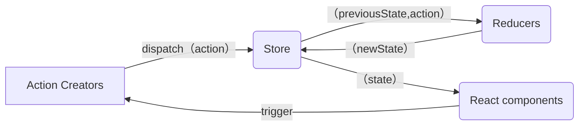

- [mini-redux](#mini-redux)
  - [Reducer](#reducer)
    - [基礎架構](#基礎架構)
  - [applymiddleware 中間件](#applymiddleware-中間件)
  - [combineReducers](#combinereducers)
  - [react-redux](#react-redux)
    - [實現 bindActionCreators](#實現-bindactioncreators)
    - [實現 Provider, connect](#實現-provider-connect)
    - [hooks - useSelector, useDispatch](#hooks---useselector-usedispatch)
    - [結合 react 18: useSyncExternalStore](#結合-react-18-usesyncexternalstore)

# mini-redux

## Reducer

接收舊的狀態和 action，返回新的狀態。
像是 `Array.reduce(reducer, initialValue);`

```js
(previousState, action) => newState;
```

是 純函數(Pure Function)，傳入相同的參數會有相同的回傳值！
所以不能夠：

1. 修改傳入的參數
2. 使副作用發生，比方 API 或是 路由跳轉
3. 調用非純的函式，比方 `Date.now()`, `Math.random()`，每次調用產生的結果都不同



- 核心要實現

  - 存儲狀態
  - 獲取狀態
  - 更新狀態
  - 變更訂閱

### 基礎架構

> src/store/index.js

```ts
// import { createStore } from "redux";
import { createStore } from "../mini-redux/index.ts";

function countReducer(state = 0, action) {
  switch (action?.type) {
    case "ADD":
      return state + 1;
    case "MINUS":
      return state - 1;
    default:
      return state;
  }
}

const store = createStore(countReducer);
export default store;
```

> src/pages/Test.tsx

```tsx
import React, { useLayoutEffect, useReducer } from "react";
import store from "../store";

const Test = () => {
  const [, forceUpdate] = useReducer((x) => x + 1, 0);

  useLayoutEffect(() => {
    return store.subscribe(() => {
      forceUpdate();
    });
  }, []);

  return (
    <div>
      state: {store.getState()}
      <button
        onClick={() => {
          store.dispatch({ type: "ADD" });
        }}
      >
        change
      </button>
    </div>
  );
};

export default Test;
```

> src/mini-redux/index.ts

```ts
import createStore from "./createStore.ts";
export { createStore };
```

> src/mini-redux/createStore.ts

```tsx
export default function createStore(reducer) {
  let currentState;
  let listeners: any[] = [];

  function getState() {
    return currentState;
  }

  function dispatch(action) {
    const newState = reducer(currentState, action);
    currentState = newState;
    listeners.forEach((l) => {
      l();
    });
  }

  function subscribe(listener: any) {
    listeners.push(listener);
    return () => {
      const index = listeners.indexOf(listener);
      listeners.splice(index, 1);
    };
  }

  // 初始數據
  dispatch({ type: "1111" });

  return {
    getState,
    dispatch,
    subscribe,
  };
}
```

## applymiddleware 中間件

如果想要處理副作用，要怎麼辦？想和服務端交互、異步處理，有辦法這樣寫嗎？

```ts
// 不是這樣
setTimeout(() => {
  store.dispatch({ type: "MINUS" });
}, 100);
// 想要改寫成這樣，異步處理 dispatch，有辦法嗎
store.dispatch((dispatch) => {
  setTimeout(() => {
    dispatch({ type: "MINUS" });
  }, 100);
});
```

redux 只是一個純粹的狀態管理工具，只支持同步。如果要支援異步，必須要使用中間件，比如 redux-thunk 和 redux-logger。對 `store.dispatch` 進行改造，在發出 action 和執行 reducer 這兩部之間，添加其他功能。

> src/store/index.js

```js
import { createStore, applyMiddleware } from "redux";
import { thunk } from "redux-thunk";
import logger from "redux-logger";

const store = createStore(countReducer, applyMiddleware(thunk, logger));
```

> src/pages/Test.tsx

```js
<button
  onClick={() => {
    store.dispatch((dispatch) => {
      setTimeout(() => {
        dispatch({ type: "ADD" });
      }, 1000);
    });
  }}
>
  async add
</button>
```

中間會需要利用 `compose` 和 `currying` 的概念。

- compose

  將三個函式結合成一個，並且把第一個函式返回值傳遞給下一個當作參數

  ```js
  function f1(arg) {
    console.log("f1", arg);
    return arg;
  }

  function f2(arg) {
    console.log("f2", arg);
    return arg;
  }

  function f3(arg) {
    console.log("f3", arg);
    return arg;
  }

  const fn = compose(f1, f2, f3);
  fn(123);
  ```

  利用 arguments 來處理

  ```js
  function compose(...funArgs) {
    if (funArgs.length === 0) {
      return (args) => args;
    }

    return function (...args) {
      const result = funArgs.reduce((acc, cur) => {
        return cur(acc);
      }, ...args);
    };
  }
  // args => f3(f2(f1(args)))
  // 可以在簡寫成這樣（但是執行的順序不同
  function compose(...funArgs) {
    if (funArgs.length === 0) {
      return (args) => args;
    }

    // 如果沒有傳初始值，則原陣列的第一個元素將會被當作初始的累加器。
    // [f1, f2, f3]。 f1 作為初始值
    // 再下一次，cur 函式會帶著 args 變成上個累加器的 arg
    // (f3(args)) => f1(f2(f3(args)))
    return funArgs.reduce((acc, cur) => {
      return (...args) => acc(cur(...args));
    });
  }
  ```

  為什麼會需要用到 `compose`?
  說到要改造 dispatch ，讓他可以層層被包住，交給下一棒處理

比方

```ts
const store = createStore(countReducer, applyMiddleware(logger2, logger));
```

發起 dispatch 時，會執行

```rust
logger2
    |
logger
    |
dispatch(action) 本身
    |
logger
    |
logger2
```

所以 middleware 要做的是，執行並且接收下一個函式 - logger 作為參數把 action ，把執行完的結果回傳。

```ts
const logger = (store) => (next) => (action) => {
  debugger;
  console.log("logger1 dispatch", action);
  const result = next(action);
  console.log("logger1 next state", store.getState());
  return result;
};

export default logger;
```

傳遞給 middleware 的 store 內的 dispatch ，不可以是最本來的，畢竟 middleware 是中間插件，最終執行的還是 `store.dispatch`。
所以針對每個 middleware 的 dispatch 必須要改寫：

```ts
const midAPI = {
  getState: store.getState,
  dispatch: (action, ...args) => store.dispatch(action, ...args),
};
```

在 `createStore` 中，接收第二個參數，也就是擴充，讓 `enhancer` 去改寫內部的 `store.dispatch`

```ts
export default function createStore(reducer, enhancer) {
  if (enhancer) {
    return enhancer(createStore)(reducer);
  }
  let currentState;
  let listeners: any[] = [];

  function getState() {
    return currentState;
  }

  function dispatch(action) {
    const newState = reducer(currentState, action);
    currentState = newState;
    listeners.forEach((l) => {
      l();
    });
  }

  function subscribe(listener: any) {
    listeners.push(listener);
    return () => {
      const index = listeners.indexOf(listener);
      listeners.splice(index, 1);
    };
  }

  // 初始數據
  dispatch({ type: "1111" });

  return {
    getState,
    dispatch,
    subscribe,
  };
}

const store = createStore(countReducer, applyMiddleware(logger2, logger));
```

```ts
export default function applyMiddleware(...middlewares) {
  return (createStore) => (reducer) => {
    const store = createStore(reducer);
    // const dispatch = store.dispatch;
    let dispatch = () => {
      throw new Error(
        "Dispatching while constructing your middleware is not allowed. " +
          "Other middleware would not be applied to this dispatch."
      );
    };
    const midAPI = {
      getState: store.getState,
      // 改寫了 dispatch 本身！
      dispatch: (action, ...args) => dispatch(action, ...args),
    };
    const chain = middlewares.map((middleware) => middleware(midAPI));

    // 再把 store.dispatch 作為參數傳入
    dispatch = compose(...chain)(store.dispatch);

    return {
      ...store,
      dispatch,
    };
  };
}

function compose(...funArgs) {
  if (funArgs.length === 0) {
    return (args) => args;
  }
  if (funArgs.length === 1) {
    return funArgs[0];
  }

  return funArgs.reduce((acc, cur) => {
    return (...args) => acc(cur(...args));
  });
}
```

🌟🌟🌟 有意思的是這段

```js
const chain = middlewares.map((middleware) => middleware(midAPI));

dispatch = compose(...chain)(store.dispatch);
```

假設 `chain = [logger2, logger]`，那麼展開的結果是：

```js
dispatch = (...args) => logger2(logger(store.dispatch))(...args);
```

執行的順序是什麼呢？
分成兩段來看 `logger2(logger(store.dispatch))`、`(...args)`。
`logger(store.dispatch)` 執行完後，回傳的會是

```ts
// 從這樣
const logger = (store) => (next) => (action) => {
  console.log("logger1 dispatch", action);
  const result = next(action);
  console.log("logger1 next state", store.getState());
  return result;
};
// 變成這樣，傳入 logger2 作為參數 next 傳入
(action) => {
  console.log("logger1 dispatch", action);
  const result = next(action);
  console.log("logger1 next state", store.getState());
  return result;
};
```

所以是 `logger2(logger1回傳函式)` 再次執行，回傳了差不多的函式，再接收 `logger2回傳函式(...args)` 作為後面執行的函式，所以是 logger2 優先執行！而不是上述 `compose` 那邊的範例的執行順序
`compose(f1, f2, f3)`，執行順序是 f3 → f2 → f1。
`compose(logger2, logger)`，執行順序是 logger2 → logger。
透過 currying 把 next 保留了。

面對異步的 dispatch，如果不處理的話，進入到 reducer 會跑到 default，

```ts
store.dispatch((dispatch) => {
  console.log("??!?!?1");
  setTimeout(() => {
    dispatch({ type: "ADD" });
  }, 1000);
});
```

模擬處理，簡單寫

```ts
const thunk =
  ({ getState, dispatch }) =>
  (next) =>
  (action) => {
    if (typeof action === "function") {
      return action(dispatch, getState);
    }
    return next(action);
  };
```

同樣如果是處理 promise，簡單寫

```ts
const thunk =
  ({ getState, dispatch }) =>
  (next) =>
  (action) => {
    return isPromise(action) ? action.then(dispatch) : next(action);
  };
```

## combineReducers

多個 reducer 時，可以分開寫再一起做處理

```ts
const store = createStore(
  combineReducers({
    count: countReducer,
    user: userReducer,
  }),
  applyMiddleware(logger2, logger, thunk)
);
```

使用時

```ts
store.getState().count;
```

```ts
export default function combineReducers(reducers) {
  return function (prevState = {}, action) {
    const nextState = {};
    let hasChanged = false;

    for (const key in reducers) {
      const reducer = reducers[key];
      nextState[key] = reducer(prevState[key], action);
      hasChanged = hasChanged || nextState[key] !== prevState[key];
    }

    // 簡單紀錄有沒有改變，返回前值或新值
    hasChanged =
      hasChanged ||
      Object.keys(nextState).length !== Object.keys(prevState).length;

    return hasChanged ? nextState : prevState;
  };
}
```

## react-redux

redux 跟 react 沒有關聯，可以獨立存在管理狀態，用 JS 寫成。因此有 react-redux 作為中間橋樑。
不用再讓用戶手動執行組件訂閱更新。

用法：直接在頂層加上 `Provider`，背後的思想是 context 跨層級傳遞數據。

```tsx
import { Provider } from "react-redux";
import store from "./store";

const root = ReactDOM.createRoot(
  document.getElementById("root") as HTMLElement
);
root.render(
  <React.StrictMode>
    <Provider store={store}>
      <App />
    </Provider>
  </React.StrictMode>
);
```

類組件要用 HOC 的方式， 接收組件作為參數返回新的組件，使用 `connect` 包裹，連接組件與 redux，
`connect` 接收兩個參數 `mapStateToProps` `mapDispatchToProps`：

```ts
mapStateToProps(state, [ownProps]):stateProps
```

需要注意性能： `ownProps` 是當前組件自己的 props，如果有且發生變化，`mapStateToProps` 就會被調用、重新計算！

```ts
mapDispatchToProps(dispatch: Object || Function, [ownProps]): dispatchProps
```

可省略不傳，默認情況下 `dispatch` 會注入到組件 props 內。
可以傳物件或是函式！
如果是物件的話，會被當成是 action creator，props 內會直接沒有 dispatch 函式可以調用。

```ts
{
    // react-redux 會在背後幫忙加上，變成 dispatch({type: "ADD"})
    add: (dispatch) => ({type: "ADD"}),
}
```

```ts
(dispatch) => {
  const creators = {
    // 如果是回傳函式，就要自行加上 dispatch
    add: (dispatch) => dispatch({ type: "ADD" }),
  };
  // 不加的話就要調用 bindActionCreators(creators, dispatch);
  const creators1 = bindActionCreators({
    minus: () => ({ type: "MINUS" }),
  });

  return {
    dispatch,
    ...creators,
  };
};
```

實際使用

```tsx
import { Component } from "react";
import { connect } from "react-redux";

/**
 * mapStateToProps 是參數，會把 state 加進去 props
 * mapStateToProps
 */
export default connect(
  // mapStateToProps,
  ({ count }) => ({ count }),
  mapDispatchToProps
)(
  class ReactReduxPage extends Component {
    render() {
      return (
        <div>
          ReactReduxPage
          {count}
        </div>
      );
    }
  }
);
```

### 實現 bindActionCreators

> src/mini-redux/index.ts

```ts
import applyMiddleware from "./applyMiddleware";
import createStore from "./createStore";
import combineReducers from "./combineReducers";
import bindActionCreators from "./bindActionCreators";

export { createStore, applyMiddleware, combineReducers, bindActionCreators };
```

> src/mini-redux/bindActionCreators.ts

```ts
function bindActionCreator(action, dispatch) {
  return (...args) => dispatch(action(...args));
}

export default function bindActionCreators(actions, dispatch) {
  let obj = {};
  for (const key in actions) {
    obj[key] = bindActionCreator(actions[key], dispatch);
  }
  return obj;
}
```

### 實現 Provider, connect

```tsx
import {
  createContext,
  ReactNode,
  useContext,
  useLayoutEffect,
  useState,
  useCallback,
} from "react";
import { bindActionCreators } from "../mini-redux";

type Store = {
  getState: () => any;
  dispatch: (action: any) => void;
  subscribe: (listener: any) => () => void;
};

const Context = createContext<Store>(null);

export function Provider({
  store,
  children,
}: {
  store: Store;
  children: ReactNode;
}) {
  return <Context.Provider value={store}>{children}</Context.Provider>;
}

export const connect =
  (mapStateToProps, mapDispatchToProps) => (WrappedComponent) => (props) => {
    const context = useContext(Context);
    const { dispatch, getState, subscribe } = context;
    let state = getState();
    if (typeof mapStateToProps === "function") {
      state = mapStateToProps(state);
    }
    let dispatchProps: Object = { dispatch };
    if (typeof mapDispatchToProps === "function") {
      dispatchProps = mapDispatchToProps(dispatch);
    } else if (typeof mapDispatchToProps === "object") {
      dispatchProps = bindActionCreators(mapDispatchToProps, dispatch);
    }

    const forceUpdate = useForceUpdate();

    // 因為 useEffect 有延遲，如果更新發生在延遲之前，就會漏掉更新
    // 像是 mini-antD-form 一樣（可以跳過去看
    useLayoutEffect(() => {
      const unsubscribe = subscribe(() => forceUpdate());
      return () => unsubscribe();
    }, [subscribe, forceUpdate]);

    return <WrappedComponent {...props} {...state} {...dispatchProps} />;
  };

function useForceUpdate() {
  const [, setState] = useState(0);

  const update = useCallback(() => {
    setState((prev) => prev + 1);
  }, []);

  return update;
}
```

應用在類組件上

```tsx
import { Component, ReactNode } from "react";
import { connect } from "../mini-react-redux";
import { bindActionCreators } from "../mini-redux";

export default connect(
  ({ count }) => ({ count }),
  //   (dispatch) => {
  //     let creators: Object = {
  //       add: () => ({ type: "ADD" }),
  //     };
  //     creators = bindActionCreators(creators, dispatch);
  //     return { dispatch, ...creators };
  //   }
  {
    add: () => ({ type: "ADD" }),
  }
)(
  class ReactReduxPage extends Component<{ count: number; add: () => void }> {
    render(): ReactNode {
      const { count, add } = this.props;
      return (
        <div>
          ReactReduxPage
          {count}
          <button onClick={add}>change</button>
        </div>
      );
    }
  }
);
```

### hooks - useSelector, useDispatch

```tsx
export default function ReactReduxHookPage({ value }) {
  const dispatch = useDispatch();
  const add = useCallback(() => {
    dispatch({ type: "ADD" });
  }, [dispatch]);
  const count = useSelector(({ count }) => count);

  return (
    <div>
      ReactReduxHookPage
      {count}
      <button onClick={add}>change</button>
    </div>
  );
}
```

hooks 一樣的原理，具體實現：

> src/mini-react-redux/index.tsx

```tsx
export function useSelector(selector) {
  const store = useContext(Context);
  const { getState, subscribe } = store;
  let selectedState = selector(getState());

  const forceUpdate = useForceUpdate();

  useLayoutEffect(() => {
    const unsubscribe = subscribe(() => forceUpdate());
    return () => unsubscribe();
  }, [subscribe, forceUpdate]);

  return selectedState;
}

export function useDispatch() {
  const store = useContext(Context);
  const { dispatch } = store;

  return dispatch;
}
```

### 結合 react 18: useSyncExternalStore

`useSyncExternalStore` 是用戶可以使用第三方狀態管理庫訂閱 react 更新。在組件頂層調用，就可以從外部 store 讀取值

```tsx
const snapshot = useSyncExternalStore(subscribe, getSnapshot, getServerSnapshot?)
```

- 返回值: store 的快照
- `subscribe`: 訂閱函式，當 store 發生變化，就會調用，更新後重新渲染，會返回清除函式
- `getSnapshot`: 讀取數據的快照函式，如果 store 未發生改變，重複調用會返回相同值; 如果發生改變，返回值也不同了（`Object.is`）就會重新渲染。
- getServerSnapshot: 在服務器端渲染時，或是客戶端進行服務器端渲染內容時使用。

> 在 react-redux 中，是使用了套件包`use-sync-external-store`，他是 react 內的替代方案，是為了適配不同的版本。

可以改寫 `useSelector` `connect`

```tsx
export const connect =
  (mapStateToProps, mapDispatchToProps) => (WrappedComponent) => (props) => {
    const context = useContext(Context);
    const { dispatch, getState, subscribe } = context;

    let dispatchProps: Object = { dispatch };
    if (typeof mapDispatchToProps === "function") {
      dispatchProps = mapDispatchToProps(dispatch);
    } else if (typeof mapDispatchToProps === "object") {
      dispatchProps = bindActionCreators(mapDispatchToProps, dispatch);
    }

    let state = useSyncExternalStore(subscribe, getState);
    if (typeof mapStateToProps === "function") {
      state = mapStateToProps(state);
    }
    // const forceUpdate = useForceUpdate();

    // 因為 useEffect 有延遲，如果更新發生在延遲之前，就會漏掉更新
    // 像是 mini-antD-form 一樣（可以跳過去看
    // useLayoutEffect(() => {
    //   const unsubscribe = subscribe(() => forceUpdate());
    //   return () => unsubscribe();
    // }, [subscribe]);

    return <WrappedComponent {...props} {...state} {...dispatchProps} />;
  };

export function useSelector(selector) {
  const store = useContext(Context);
  const { getState, subscribe } = store;

  //   const forceUpdate = useForceUpdate();

  //   useLayoutEffect(() => {
  //     const unsubscribe = subscribe(() => forceUpdate());
  //     return () => unsubscribe();
  //   }, [subscribe, forceUpdate]);

  const state = useSyncExternalStore(subscribe, getState);
  let selectedState = selector(state);

  return selectedState;
}
```
