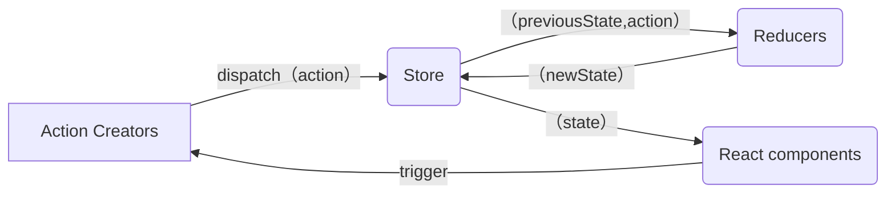

# mini-redux

## Reducer

接收舊的狀態和 action，返回新的狀態。
像是 `Array.reduce(reducer, initialValue);`

```js
(previousState, action) => newState;
```

是 純函數(Pure Function)，傳入相同的參數會有相同的回傳值！
所以不能夠：

1. 修改傳入的參數
2. 使副作用發生，比方 API 或是 路由跳轉
3. 調用非純的函式，比方 `Date.now()`, `Math.random()`，每次調用產生的結果都不同



- 核心要實現

  - 存儲狀態
  - 獲取狀態
  - 更新狀態
  - 變更訂閱

### 基礎架構

> src/store/index.js

```ts
// import { createStore } from "redux";
import { createStore } from "../mini-redux/index.ts";

function countReducer(state = 0, action) {
  switch (action?.type) {
    case "ADD":
      return state + 1;
    case "MINUS":
      return state - 1;
    default:
      return state;
  }
}

const store = createStore(countReducer);
export default store;
```

> src/pages/Test.tsx

```tsx
import React, { useLayoutEffect, useReducer } from "react";
import store from "../store";

const Test = () => {
  const [, forceUpdate] = useReducer((x) => x + 1, 0);

  useLayoutEffect(() => {
    return store.subscribe(() => {
      forceUpdate();
    });
  }, []);

  return (
    <div>
      state: {store.getState()}
      <button
        onClick={() => {
          store.dispatch({ type: "ADD" });
        }}
      >
        change
      </button>
    </div>
  );
};

export default Test;
```

> src/mini-redux/index.ts

```ts
import createStore from "./createStore.ts";
export { createStore };
```

> src/mini-redux/createStore.ts

```tsx
export default function createStore(reducer) {
  let currentState;
  let listeners: any[] = [];

  function getState() {
    return currentState;
  }

  function dispatch(action) {
    const newState = reducer(currentState, action);
    currentState = newState;
    listeners.forEach((l) => {
      l();
    });
  }

  function subscribe(listener: any) {
    listeners.push(listener);
    return () => {
      const index = listeners.indexOf(listener);
      listeners.splice(index, 1);
    };
  }

  // 初始數據
  dispatch({ type: "1111" });

  return {
    getState,
    dispatch,
    subscribe,
  };
}
```

